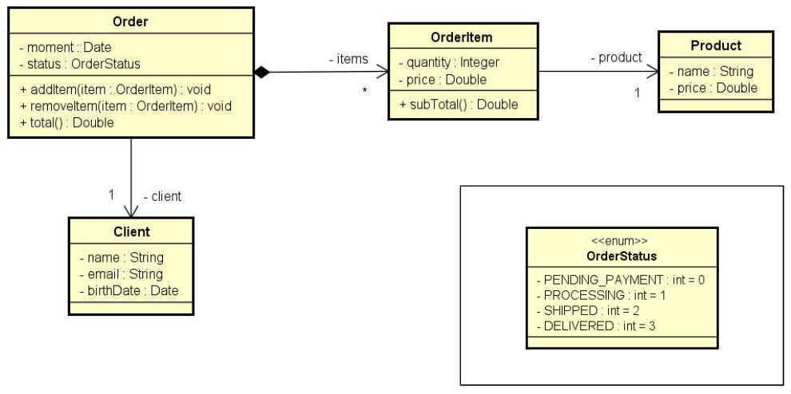

# Composition Exercise

---

Read data from an order with N items. Then show a
order summary.



---

## Output example

```shell
Enter client data:
Name: Alex Green
Email: alex@gmail.com
Birth date (DD/MM/YYYY): 15/03/1985
Enter order data:
Status: PROCESSING
How many items to this order? 2

Enter -#1 item data:
Product name: TV
Product price: 1000.00
Quantity: 1

Enter -#2 item data:
Product name: Mouse
Product price: 40.00
Quantity: 2

ORDER SUMMARY:
Order moment: 20/04/2018 11:25:09
Order status: PROCESSING
Client: Alex Green (15/03/1985) - alex@gmail.com
Order items:
TV, $1000.00, Quantity: 1, Subtotal: $1000.00
Mouse, $40.00, Quantity: 2, Subtotal: $80.00
Total price: $1080.00
```