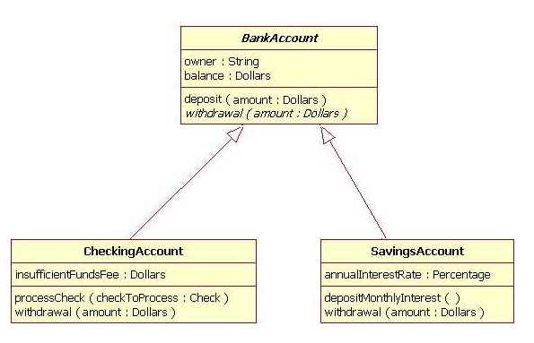

# Inheritance and Polymorphism

---

## Inheritance

Inheritance is a way to form new classes using classes that have already been defined. The newly formed classes are called **derived classes**, the classes that we derive from are called **base classes**. Important benefits of inheritance are code reuse and reduction of complexity of a program. The derived classes (descendants) override or extend the functionality of base classes (ancestors).

> Example:

A bank has two types of accounts: `Account` and `BusinessAccount`. And business accounts have all features of accounts plus some additional features, like loan.


<details>
<summary>without inheritance</summary>

```java
public class Account {
    private Integer number;
    private String holder;
    private Double balance;
    
    public Account() {
    }
    
    public Account(Integer number, String holder, Double balance) {
        this.number = number;
        this.holder = holder;
        this.balance = balance;
    }
    
    public void withdraw(Double amount) {
        balance -= amount;
    }
    
    public void deposit(Double amount) {
        balance += amount;
    }
    
    public Integer getNumber() {
        return number;
    }
    
    public void setNumber(Integer number) {
        this.number = number;
    }
    
    public String getHolder() {
        return holder;
    }
    
    public void setHolder(String holder) {
        this.holder = holder;
    }
    
    public Double getBalance() {
        return balance;
    }
}

public class BusinessAccount {
    private Integer number;
    private String holder;
    private Double balance;
    private Double loanLimit;
    
    public BusinessAccount() {
    }
    
    public BusinessAccount(Integer number, String holder, Double balance, Double loanLimit) {
        this.number = number;
        this.holder = holder;
        this.balance = balance;
        this.loanLimit = loanLimit;
    }
    
    public void withdraw(Double amount) {
        balance -= amount;
    }
    
    public void deposit(Double amount) {
        balance += amount;
    }
    
    public Integer getNumber() {
        return number;
    }
    
    public void setNumber(Integer number) {
        this.number = number;
    }
    
    public String getHolder() {
        return holder;
    }
    
    public void setHolder(String holder) {
        this.holder = holder;
    }
    
    public Double getBalance() {
        return balance;
    }
    
    public Double getLoanLimit() {
        return loanLimit;
    }
    
    public void setLoanLimit(Double loanLimit) {
        this.loanLimit = loanLimit;
    }
    
    public void loan(Double amount) {
        if (amount <= loanLimit) {
            balance += amount - 10.0;
        }
    }
}
```
</details>

The problem is that we have to repeat the code of `Account` in `BusinessAccount`. And if we want to change something in `Account`, we have to change in `BusinessAccount` too.

The inheritance solves this problem. We can create a class `Account` and make `BusinessAccount` inherit from `Account`. So `BusinessAccount` will have all features of `Account` plus some additional features.

In UML, we represent inheritance with an arrow pointing to the base class.



<details>
<summary>with inheritance</summary>

```java
public class Account {
    private Integer number;
    private String holder;
    private Double balance;
    
    public Account() {
    }
    
    public Account(Integer number, String holder, Double balance) {
        this.number = number;
        this.holder = holder;
        this.balance = balance;
    }
    
    public void withdraw(Double amount) {
        balance -= amount;
    }
    
    public void deposit(Double amount) {
        balance += amount;
    }
    
    public Integer getNumber() {
        return number;
    }
    
    public void setNumber(Integer number) {
        this.number = number;
    }
    
    public String getHolder() {
        return holder;
    }
    
    public void setHolder(String holder) {
        this.holder = holder;
    }
    
    public Double getBalance() {
        return balance;
    }
}

public class BusinessAccount extends Account {
    private Double loanLimit;
    
    public BusinessAccount() {
        super();
    }
    
    public BusinessAccount(Integer number, String holder, Double balance, Double loanLimit) {
        super(number, holder, balance);
        this.loanLimit = loanLimit;
    }
    
    public Double getLoanLimit() {
        return loanLimit;
    }
    
    public void setLoanLimit(Double loanLimit) {
        this.loanLimit = loanLimit;
    }
    
    public void loan(Double amount) {
        if (amount <= loanLimit) {
            balance += amount - 10.0;
        }
    }
}
```

</details>

With inheritance, we can reuse the code of `Account` in `BusinessAccount`. And if we want to change something in `Account`, we don't have to change in `BusinessAccount`. And if we need, we can use all features of `Account` in `BusinessAccount`.

> Note: In Java, a class can only inherit from one class. So we can't have multiple inheritance.