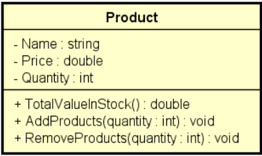

## **Write a program to read the data of a product in stock (name, price and quantity in stock). Right away:**

- Show product data (name, price, quantity in stock, total value in stock)
- Perform a stock entry and show product data again
- Perform a stock output and show the product data again To resolve this issue, you must create a `CLASS` according to the project below:



> Example:
> ```shell
> Enter product data:
> Name: TV
> Price: 900.00
> Quantity in stock: 10
> 
> Product data: TV, $ 900.00, 10 units, Total: $ 9000.00
> 
> Enter the number of products to be added in stock: 5
> 
> Updated data: TV, $ 900.00, 15 units, Total: $ 13500.00
> 
> Enter the number of products to be removed from stock: 3
> 
> Updated data: TV, $ 900.00, 12 units, Total: $ 10800.00
> ```
